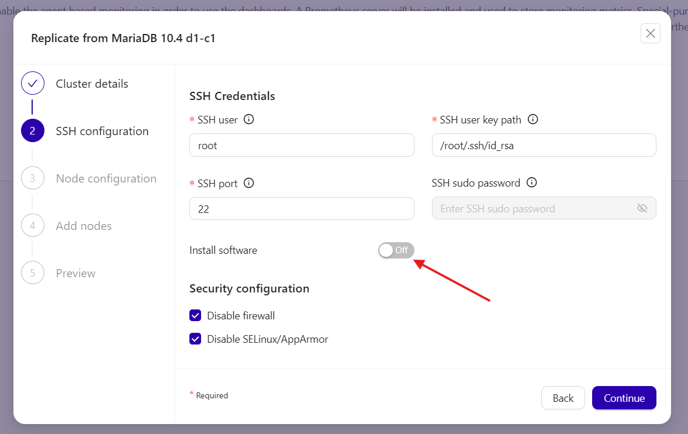

# Upgrading MariaDB (Galera) from 10.4 to 10.6
Instructions on how to upgrade MariaDB Galera setup.

#### References

#### Highlevel Steps
https://docs.google.com/presentation/d/1GaqwR1rFb1jJN_7d7wJ30WPc0MV33um8F2naIWYwuug/edit

### NOTE: Replace anything in curly brackets with relevant values

## Step 0 : Deploy software
### Step 0-1 : Deploy CC2 (beyond the scope of this document)
### Step 0-2 : Deploy MariaDB galera software
Download MariaDB 10.6 packages from https://dlm.mariadb.com/browse/mariadb_server/10.6.21/yum/rhel/9Server/x86_64/rpms/
Download MariaDB 10.4 packages from https://dlm.mariadb.com/browse/mariadb_server/10.4.34/yum/rhel/8Server/x86_64/rpms/

#### MariaDB 10.6 and Galera 4
All the D?_C?_N hosts need to have the following packages on them

galera-4-26.4.21-1.el9.x86_64.rpm
MariaDB-backup-10.6.21-1.el9.x86_64.rpm
MariaDB-client-10.6.21-1.el9.x86_64.rpm
MariaDB-server-10.6.21-1.el9.x86_64.rpm
MariaDB-shared-10.6.21-1.el9.x86_64.rpm
MariaDB-common-10.6.21-1.el9.x86_64.rpm

#### MariaDB 10.4 and Galera 4
The INTERM_HOST needs to have the following packages on it

galera-4-26.4.18-1.el8.x86_64.rpm
MariaDB-backup-10.4.34-1.el8.x86_64.rpm
MariaDB-client-10.4.34-1.el8.x86_64.rpm
MariaDB-server-10.4.34-1.el8.x86_64.rpm
MariaDB-shared-10.4.34-1.el8.x86_64.rpm
MariaDB-common-10.4.34-1.el8.x86_64.rpm

## Step 1 : Create Intermediate (MariaDB 10.4) Replica (single node galera)
### Step 1-1 : Create Intermediate (MariaDB 10.4) Replica through CC2
#### Install MariaDB and Galera packages (manual)
Install the database packages manually on the respective hosts:
```
dnf localinstall *.rpm
```

#### Deploying through ClusterControl (CC2)



### Step 1-2 : Create Binary backup of Prod
Select one of the nodes in the Prod galera cluster and SSH to it.

On PROD_BACKUP_HOST:
```
ssh {PROD_BACKUP_HOST}

# NOTE: change the location of the backup and make sure mysql user has privs to write to the location.
# NOTE: you may also have to pass in "--user=value --password=value" options...
sudo su - mysql
mkdir -p {PROD_BACKUP_LOC}
ulimit -n 256000 && LC_ALL=C mariadb-backup --defaults-file=/etc/my.cnf \
    --backup --galera-info --slave-info --parallel=1 --stream=xbstream | \
    gzip -6 - > {PROD_BACKUP_LOC}/backup-full-1.xbstream.gz  2>&1
exit
sudo su -
mv {PROD_BACKUP_LOC}/backup-full-1.xbstream.gz /tmp
exit
sudo chown {SHELL_USER:SHELL_USER} /tmp/backup-full-1.xbstream.gz
```
NOTE: Please record the binlog file, position and GTID. It will be a line such as the following
```
[e.g.] MySQL binlog position: filename 'binlog.000013', position '379', GTID of the last change '87000-87000-478'
```

### Step 1-3 : Transfer Binary backup of Prod to Intermediate
On INTERM_HOST:
```
# Example
scp {SHELL_USER}@{PROD_BACKUP_HOST}:/tmp/backup-full-1.xbstream.gz /tmp
```

### Step 1-4 : Restore Binary backup of Prod on Intermediate
#### Stop the node (i.e., the single node galera cluster) from CC2
This will stop the MariaDB server on the single node galera. Verify that it is indeed stopped by:
```
sudo systemctl status mariadb
```
#### Restore backup
Now you are ready start restore. Unzip and extract the backup first

On INTERM_HOST:
```
# Example
cd /tmp
ls -al
-rw-rw-r--.  1 cloud-user cloud-user 70519388 Mar 13 18:51 backup-full-1.xbstream.gz

gunzip backup-full-1.xbstream.gz 
mkdir prod-backup
cd prod-backup
mbstream -x < ../backup-full-1.xbstream
ls -l
-rw-rw----. 1 cloud-user cloud-user     49152 Mar 13 16:11 aria_log.00000001
-rw-rw----. 1 cloud-user cloud-user        52 Mar 13 16:11 aria_log_control
-rw-rw----. 1 cloud-user cloud-user       326 Mar 13 16:11 backup-my.cnf
-rw-rw----. 1 cloud-user cloud-user       379 Mar 13 16:11 binlog.000010
-rw-rw-r--. 1 cloud-user cloud-user       318 Mar 13 15:52 cmon_backup.log
-rw-------. 1 cloud-user cloud-user      3041 Mar 13 15:52 cmon_backup.metadata
drwx------. 2 cloud-user cloud-user      4096 Mar 13 16:11 employees
-rw-rw----. 1 cloud-user cloud-user       972 Mar 13 16:11 ib_buffer_pool
-rw-rw----. 1 cloud-user cloud-user      2560 Mar 13 16:11 ib_logfile0
-rw-rw----. 1 cloud-user cloud-user 104857600 Mar 13 16:11 ibdata1
drwx------. 2 cloud-user cloud-user        84 Mar 13 16:11 menagerie
drwx------. 2 cloud-user cloud-user      4096 Mar 13 16:11 mysql
drwx------. 2 cloud-user cloud-user      4096 Mar 13 16:11 nation
drwx------. 2 cloud-user cloud-user        20 Mar 13 16:11 performance_schema
drwx------. 2 cloud-user cloud-user      4096 Mar 13 16:11 sakila
drwx------. 2 cloud-user cloud-user       144 Mar 13 16:11 world
-rw-rw----. 1 cloud-user cloud-user        34 Mar 13 16:11 xtrabackup_binlog_info
-rw-rw----. 1 cloud-user cloud-user       105 Mar 13 16:11 xtrabackup_checkpoints
-rw-rw----. 1 cloud-user cloud-user        41 Mar 13 16:11 xtrabackup_galera_info
-rw-rw----. 1 cloud-user cloud-user       556 Mar 13 16:11 xtrabackup_info
```
##### Prepare the backup
```
sudo chown -R mysql:mysql /tmp/prod-backup
sudo su - mysql
mariabackup --prepare --target-dir=/tmp/prod-backup/
exit
```
##### Copy back the backup to datair of MariaDB
```
sudo su - mysql
cd /var/lib
/bin/rm -rf ./mysql/*

ls -l ./mysql
# should be empty

mariabackup --move-back --target-dir=/tmp/prod-backup/
exit
```
#### Start the node from CC2 (use bootstrap cluster option)
NOTE: do **NOT** select the "**initial start**" option

#### Grant privileges to CC2 to monitor the single node galera 
You will need the following:
* CC2's hostname
* CC2's ipv4 address
* Password used by CC2 to monitor the single node cluster. This can be obtained from the CC2 host's /etc/cmon.d/cmon_CID.cnf file (search for "mysql_password" attribute)

On INTERM_HOST:
```
sudo su - mysql
mysql -u root -p
CREATE USER 'cmon'@'{CC2_HOST}' IDENTIFIED BY '{INTERM_CMON_PW}';
CREATE USER 'cmon'@'{CC2_IP}' IDENTIFIED BY '{INTERM_CMON_PW}';
GRANT ALL PRIVILEGES ON *.* TO 'cmon'@'{CC2_HOST}' IDENTIFIED BY '{INTERM_CMON_PW}' WITH GRANT OPTION;
GRANT ALL PRIVILEGES ON *.* TO 'cmon'@'{CC2_IP}' IDENTIFIED BY '{INTERM_CMON_PW}' WITH GRANT OPTION;
FLUSH PRIVILEGES;
exit
exit
```

### Step 1-5 : Setup Intermediate as Slave of Prod (and allow to sync)
#### Create and Grant privileges for the replication user on the Prod cluster
You will need the following:
* Intermediate's hostname
* Intermediate's ipv4 address
* A password to use for auth. Just generate one and remember it.

On PROD_BACKUP_HOST:
```
sudo su - mysql
mysql -u root -p
GRANT REPLICATION SLAVE ON *.* TO '{MIGRATION_REPL_USER}'@'{INTERM_HOST}' IDENTIFIED BY '{MIGRATION_REPL_USER_PW}';
GRANT REPLICATION SLAVE ON *.* TO '{MIGRATION_REPL_USER}'@'{INTERM_HOST_IP}' IDENTIFIED BY '{MIGRATION_REPL_USER_PW}';
FLUSH PRIVILEGES;

```
#### Setup replication from PROD_BACKUPHOST to Intermediate
You will need the following info:
* PROD_BACKUP_HOST
* Replication user: repluser_intermediate
* Replication user password: 
* GTID from the /tmp/prod-backup/xtrabackup_binlog_info file (on Intermediate host) or from the terminal where you ran mariabackup on the PROD_BACKUPHOST
  (binlog.000013	379	87000-87000-478)

On INTERM_HOST:
```
CHANGE MASTER TO 
   MASTER_HOST="{PROD_BACKUP_HOST}", 
   MASTER_USER="{MIGRATION_REPL_USER}",  
   MASTER_PASSWORD="{MIGRATION_REPL_USER_PW}", 
   MASTER_LOG_FILE='{CHANGE_ME}',
   MASTER_LOG_POS={CHANGE_ME};
START SLAVE;
```

### Step 1-6 : Create Backup of Intermediate from CC
**Optional**

### Step 1-7 : Upgrade Intermediate to Maria 10.6
On INTERM_HOST:
#### Stop slave
```
sudo su - mysql
mysql -u root -p
STOP SLAVE;
SHOW SLAVE STATUS;
```

#### Update repo file (or get the Maria 10.6.21 rpms to the intermediate host)
```
cat /etc/yum.repos.d/mariadb.repo

[mariadb-main]
name = MariaDB Server
baseurl = https://dlm.mariadb.com/repo/mariadb-server/10.4/yum/rhel/8/x86_64
gpgkey = file:///etc/pki/rpm-gpg/MariaDB-Server-GPG-KEY
gpgcheck = 1
enabled = 1
module_hotfixes = 1

[mariadb-tools]
name = MariaDB Tools
baseurl = https://downloads.mariadb.com/Tools/rhel/8/x86_64
gpgkey = file:///etc/pki/rpm-gpg/MariaDB-Enterprise-GPG-KEY
gpgcheck = 1
```

At the time of this writing the latest 10.6 version is 10.6.21
Modify version
```
cp /etc/yum.repos.d/mariadb.repo /tmp
sudo sed -i 's/10.4/10.6/' /etc/yum.repos.d/mariadb.repo
cat /etc/yum.repos.d/mariadb.repo
[mariadb-main]
name = MariaDB Server
baseurl = https://dlm.mariadb.com/repo/mariadb-server/10.6/yum/rhel/8/x86_64
gpgkey = file:///etc/pki/rpm-gpg/MariaDB-Server-GPG-KEY
gpgcheck = 1
enabled = 1
module_hotfixes = 1

[mariadb-tools]
name = MariaDB Tools
baseurl = https://downloads.mariadb.com/Tools/rhel/8/x86_64
gpgkey = file:///etc/pki/rpm-gpg/MariaDB-Enterprise-GPG-KEY
gpgcheck = 1
enabled = 1
```

#### Stop the MariaDB 10.4 node (INTERM_HOST) from ClusterControl

#### Backup data, config and logs
On INTERM_HOST:
```
sudo su - mysql
cd /var
tar cvfz /tmp/mysql_log.tgz ./log/mysql
tar cvfz /tmp/mysql_data.tgz ./lib/mysql
cd /etc
tar cvfz /tmp/mysql_config.tgz ./my*
ls -al  /tmp/mysql_*
-rw-rw-r--. 1 mysql mysql     9448 Mar 13 21:23 /tmp/mysql_config.tgz
-rw-rw-r--. 1 mysql mysql 71948196 Mar 13 21:23 /tmp/mysql_data.tgz
-rw-rw-r--. 1 mysql mysql   138363 Mar 13 21:22 /tmp/mysql_log.tgz
exit
```

#### Remove MariaDB 10.4 packages
On INTERM_HOST:

```
sudo dnf list installed MariaDB-*
MariaDB-backup.x86_64                                                     10.4.34-1.el8                                                     @mariadb-main
MariaDB-client.x86_64                                                     10.4.34-1.el8                                                     @mariadb-main
MariaDB-common.x86_64                                                     10.4.34-1.el8                                                     @mariadb-main
MariaDB-server.x86_64                                                     10.4.34-1.el8                                                     @mariadb-main
MariaDB-shared.x86_64                                                     10.4.34-1.el8                                                     @mariadb-main
```

```
sudo dnf list installed galera-4
galera-4.x86_64                                                        26.4.18-1.el8                                                        @mariadb-main
```

```
sudo yum remove -y MariaDB-server MariaDB-backup MariaDB-common MariaDB-shared MariaDB-client galera-4
```

#### Install MariaDB 10.6 packages
On INTERM_HOST:

```
sudo dnf -y install MariaDB-server galera-4 MariaDB-client MariaDB-shared MariaDB-backup MariaDB-common
sudo dnf list installed MariaDB-* galera-*
```

##### Make Configuration File Changes
On INTERM_HOST:

```
cd /tmp
mkdir etc
cd etc
tar xvf ../mysql_config.tgz
sudo su -
cd /etc
mv my.cnf my.cnf.10-6.default
cp /tmp/etc/my.cnf .
exit
```

##### Start upgraded MariaDB 10.6 node (INTERM_HOST) from ClusterControl
**NOTE**: do not select any extra start options in the CC2 UI while starting node.
```
sudo systemctl status mariadb
```

##### Run mariadb-upgrae with --skip-write-binlog
On INTERM_HOST:

```
sudo su - mysql
mariadb-upgrade -u root -p -v --skip-write-binlog
Enter password: 
Looking for 'mariadb' as: mariadb
Looking for 'mariadb-check' as: mariadb-check
Empty or non existent /var/lib/mysql/mysql_upgrade_info. Assuming mysql_upgrade has to be run!
Phase 1/8: Checking and upgrading mysql database
Processing databases
mysql
mysql.column_stats                                 OK
...
mysql.wsrep_cluster                                OK
mysql.wsrep_cluster_members                        OK
mysql.wsrep_streaming_log                          OK
Phase 2/8: Installing used storage engines... Skipped
...
Phase 3/8: Running 'mysql_fix_privilege_tables'
...
Phase 4/8: Fixing views
...
Phase 5/8: Fixing table and database names
Processing databases
...
Phase 6/8: Checking and upgrading tables
...
Phase 7/8: uninstalling plugins
...
Phase 8/8: Running 'FLUSH PRIVILEGES'
OK

exit
```

Restart MariaDB server
```
sudo systemctl restart mariadb
sudo systemctl status mariadb
```

##### Update MariaDB (and Galera) version in ClusterControl (CC2 host)
On CC2_HOST:

Find the cluster ID (CID) of the cluster in ClusterControl. Update the config as shown below.
```
ssh {CC2_HOST}
sudo vi /etc/cmon.d/cmon_CID.cnf
# find and replace the version
#mysql_version=10.4
mysql_version=10.6
#galera_version=3.x
galera_version=4.x
```
Restart ClusterControl (CMON)
```
sudo systemctl restart cmon
```

### Step 1-8 : Allow Intermediate to sync wit Prod (INTERM_HOST)
On INTERM_HOST:
```
sudo su - mysql
mysql -u root -p
SHOW SLAVE STATUS \G
```

### Step 1-9 : Take a backup of MariaDB 10.6 of Intermediate (manual)
On INTERM_HOST:
```
# NOTE: change the location of the backup and make sure mysql user has privs to write to the location.
# NOTE: you may also have to pass in "--user=value --password=value" options...
sudo su - mysql
mkdir -p {PROD_BACKUP_LOC}
ulimit -n 256000 && LC_ALL=C mariadb-backup --defaults-file=/etc/my.cnf \
    --backup --galera-info --slave-info --parallel=1 --stream=xbstream | \
    gzip -6 - > {PROD_BACKUP_LOC}/backup-intermediate-10_6-1.xbstream.gz  2>&1

# MySQL binlog position: filename 'binlog.000024', position '395', GTID of the last change '80000-80000-26,87000-87000-509'

exit
sudo su -
mv {PROD_BACKUP_LOC}/backup-intermediate-10_6-1.xbstream.gz /tmp
exit
sudo chown {SHELL_USER:SHELL_USER} /tmp/backup-intermediate-10_6-1.xbstream.gz
```
NOTE: Please record the binlog file, position and GTID. It will be a line such as the following
```
[e.g] MySQL binlog position: filename 'binlog.000024', position '395', GTID of the last change '80000-80000-26,87000-87000-509'
```

## Step 2 : Deploy new (single node) D1_C1 and D1_C2 Maria 10.6 galera clusters from CC2 that would be Slaves of Intermediate
### Step 2-1 : Deploy new (single node) D1_C1 and D1_C2 Maria 10.6 galera clusters from CC2
Deploy on hosts D1_C1_1 and D1_C2_1
### Step 2-2 (A) : Restore Intermediate's backup on D1_C1_1 (manual)
#### Transfer Intermediate's backup to D1_C1_1
On D1_C1_1:
```
# Example
scp {SHELL_USER}@{INTERM_HOST}:/tmp/backup-intermediate-10_6-1.xbstream.gz /tmp
```
#### Stop MariaDB node of (D1_C1_1) from CC2
```
sudo systemctl status mariadb
```
#### Restore backup
Now you are ready start restore. Unzip and extract the backup first
```
# Example
cd /tmp
ls -al
-rw-r--r--. 1 cloud-user cloud-user 70504527 Mar 13 22:56 backup-intermediate-10_6-1.xbstream.gz

gunzip backup-intermediate-10_6-1.xbstream.gz 
mkdir prod-backup
cd prod-backup
mbstream -x < ../backup-intermediate-10_6-1.xbstream
ls -l
-rw-r-----. 1 cloud-user cloud-user    499712 Mar 13 23:04 aria_log.00000001
-rw-r-----. 1 cloud-user cloud-user        52 Mar 13 23:04 aria_log_control
-rw-r-----. 1 cloud-user cloud-user       286 Mar 13 23:04 backup-my.cnf
-rw-r-----. 1 cloud-user cloud-user       395 Mar 13 23:04 binlog.000024
-rw-r-----. 1 cloud-user cloud-user        46 Mar 13 23:04 donor_galera_info
drwx------. 2 cloud-user cloud-user      4096 Mar 13 23:04 employees
drwx------. 2 cloud-user cloud-user        60 Mar 13 23:04 foo
-rw-r-----. 1 cloud-user cloud-user      2506 Mar 13 23:04 ib_buffer_pool
-rw-r-----. 1 cloud-user cloud-user 104857600 Mar 13 23:04 ibdata1
-rw-r-----. 1 cloud-user cloud-user     10752 Mar 13 23:04 ib_logfile0
drwx------. 2 cloud-user cloud-user        84 Mar 13 23:04 menagerie
drwx------. 2 cloud-user cloud-user      4096 Mar 13 23:04 mysql
drwx------. 2 cloud-user cloud-user      4096 Mar 13 23:04 nation
drwx------. 2 cloud-user cloud-user        20 Mar 13 23:04 performance_schema
drwx------. 2 cloud-user cloud-user      4096 Mar 13 23:04 sakila
drwx------. 2 cloud-user cloud-user      8192 Mar 13 23:04 sys
drwx------. 2 cloud-user cloud-user       144 Mar 13 23:04 world
-rw-r-----. 1 cloud-user cloud-user        49 Mar 13 23:04 xtrabackup_binlog_info
-rw-r-----. 1 cloud-user cloud-user       105 Mar 13 23:04 xtrabackup_checkpoints
-rw-r-----. 1 cloud-user cloud-user        46 Mar 13 23:04 xtrabackup_galera_info
-rw-r-----. 1 cloud-user cloud-user       584 Mar 13 23:04 xtrabackup_info
-rw-r-----. 1 cloud-user cloud-user        71 Mar 13 23:04 xtrabackup_slave_info
cat xtrabackup_binlog_info 
# binlog.000024	395	80000-80000-26,87000-87000-509
cat xtrabackup_slave_info 
# CHANGE MASTER TO MASTER_LOG_FILE='binlog.000013', MASTER_LOG_POS=4817;
```

##### Prepare the backup
```
sudo chown -R mysql:mysql /tmp/prod-backup
sudo su - mysql
mariabackup --prepare --target-dir=/tmp/prod-backup/
exit
```

##### Copy back the backup to datair of MariaDB
```
sudo su - mysql
mkdir /tmp/backup-before-restore-datadir
cd /var/lib
tar cvfz /tmp/backup-before-restore-datadir/mysql-datadir.tgz ./mysql
/bin/rm -rf ./mysql/*
ls -l ./mysql
mariabackup --copy-back --target-dir=/tmp/prod-backup/
exit
```

#### Start the D1_C1 node from CC2 (use bootstrap cluster option)
NOTE: do **NOT** select the "**initial start**" option

#### Grant privileges to CC2 to monitor the single node galera
You will need the following:
* CC2's hostname
* CC2's ipv4 address
* Password used by CC2 to monitor the D1_C1 node/cluster. This can be obtained from the CC2 host's /etc/cmon.d/cmon_CID.cnf file (search for "mysql_password" attribute)

```
# make necessary changes below the controller_ip_address, the controller_hostname, and the password. Here controller is CC2
#sudo su - mysql
#mysql -u root -p
#CREATE USER 'cmon'@'{CC2_HOST}' IDENTIFIED BY '{INTERM_CMON_PW}';
#CREATE USER 'cmon'@'{CC2_IP}' IDENTIFIED BY '{INTERM_CMON_PW}';
#GRANT ALL PRIVILEGES ON *.* TO 'cmon'@'{CC2_HOST}' IDENTIFIED BY '{INTERM_CMON_PW}' WITH GRANT OPTION;
#GRANT ALL PRIVILEGES ON *.* TO 'cmon'@'{CC2_IP}' IDENTIFIED BY '{INTERM_CMON_PW}' WITH GRANT OPTION;
#FLUSH PRIVILEGES;
#exit
#exit
```

### Step 2-2 (B) : Restore Intermediate's backup on D1_C2_1 (manual)
Repeat Step (2-2) for D1_C2_1

### Step 2-3 : Sync on D1_C1_1 and D1_C2_2 (manual) from Intermediate

#### Create and Grant privileges for the replication user on the Intermediate node
You will need the following:
* D1_C1's (and D1_C2's) hostname
* D1_C1's (and D1_C2's) ipv4 address
* A password to use for auth. Just generate one and remember it.

On INTERM_HOST:
```
sudo su - mysql
mysql -u root -p
GRANT REPLICATION SLAVE ON *.* TO '{MIGRATION_REPL_USER}'@'{D1_C1_1}' IDENTIFIED BY '{MIGRATION_REPL_USER_PW}';
GRANT REPLICATION SLAVE ON *.* TO '{MIGRATION_REPL_USER}'@'{D1_C1_1_IP}' IDENTIFIED BY '{MIGRATION_REPL_USER_PW}';
GRANT REPLICATION SLAVE ON *.* TO '{MIGRATION_REPL_USER}'@'{D1_C2_1}' IDENTIFIED BY '{MIGRATION_REPL_USER_PW}';
GRANT REPLICATION SLAVE ON *.* TO '{MIGRATION_REPL_USER}'@'{D1_C2_1_IP}' IDENTIFIED BY '{MIGRATION_REPL_USER_PW}';
FLUSH PRIVILEGES;
exit
exit
```

#### Setup replication from INTERM_HOST to D1_C1_1 and D1_C2_1
You will need the following info:
* INTERM_HOST
* Replication user: repluser_intermediate
* Replication user password:
* GTID from the /tmp/prod-backup/xtrabackup_binlog_info file (on Intermediate host) or from the terminal where you ran mariabackup on the PROD_BACKUPHOST
  (binlog.000024	395	80000-80000-26,87000-87000-509)

On D1_C1_1 and D1_C2_1:
```
CHANGE MASTER TO 
   MASTER_HOST="INTERM_HOST", 
   MASTER_USER="{MIGRATION_REPL_USER}",  
   MASTER_PASSWORD="{MIGRATION_REPL_USER_PW}", 
   MASTER_LOG_FILE='{CHANGE_ME}',
   MASTER_LOG_POS={CHANGE_ME};
START SLAVE;
```
